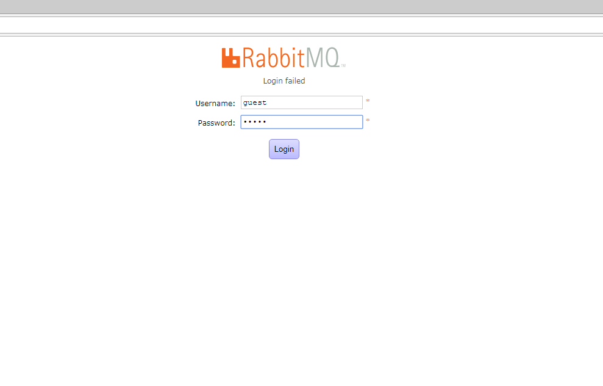
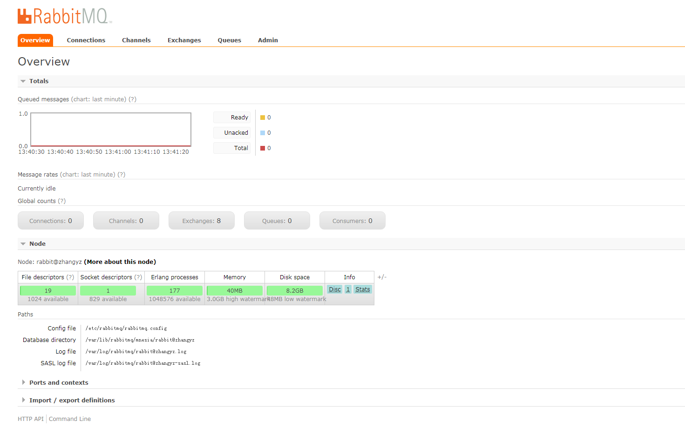

#### 如何在linux上编译安装rabbitmq
```shell
[root@zhangyz ~]# yum install zlib zlib-devel
```

在安装Erlang在安装之前，要安装一些其他的软件否则在安装中间会出现一些由于没有其依赖的软件模块而失败, 首先要先安装gcc gcc-c++ Openssl等模块

```shell
[root@zhangyz ~]# yum -y install make gcc gcc-c++ kernel-devel m4 ncurses-devel openssl-devel  
```

#### 下载Erang源代码文件并对其解压
```shell
[root@zhangyz ~]# wget http://www.erlang.org/download/otp_src_R16B02.tar.gz
[root@zhangyz ~]# tar -xf otp_src_R16B02.tar.gz -C /
[root@zhangyz ~]# cd /
[root@zhangyz /]# mv otp_src_R16B02 erlang_R16B   #重命名解压后的文件 
[root@zhangyz /]# cd erlang_R16B/ 
[root@zhangyz erlang_R16B]# ./configure --prefix=/usr/local/erlang \
--with-ssl \
--enable-threads \
--enable-smp-support \
--enable-kernel-poll \
--enable-hipe
[root@zhangyz erlang_R16B]# make && make install
```
#### 配置erlang环境

```shell
vim /etc/profile 
export PATH=$PATH:/usr/local/erlang/bin
source /etc/profile 
```

#### 测试一下是否安装成功在控制台输入命令 erl

```shell
[root@zhangyz ~]# erl
Erlang/OTP 20 [erts-9.1.2] [source] [64-bit] [smp:1:1] [ds:1:1:10] [async-threads:10] 
Eshell V9.1.2  (abort with ^G)
1> 
```

#### 在linux上安装rabbitmq-server-3.1.5

来看一下如何在linux上安装RabbitMQ我使用的rabbitmq的版本是rabbitmq-server-3.1.5.tar.gz 安装rabbitmq的具体步骤如下:

下载rabbitmq-server-3.1.5.tar.gz 文件并解压：

```shell
[root@zhangyz ~]# wget http://www.rabbitmq.com/releases/rabbitmq-server/v3.1.5/rabbitmq-server-3.1.5.tar.gz
[root@zhangyz ~]# tar -xzvf rabbitmq-server-3.1.5.tar.gz
--2018-05-04 15:06:43--  http://www.rabbitmq.com/releases/rabbitmq-server/v3.1.5/rabbitmq-server-3.1.5.tar.gz
Resolving www.rabbitmq.com... 104.20.63.197, 104.20.62.197, 2400:cb00:2048:1::6814:3ec5, ...
Connecting to www.rabbitmq.com|104.20.63.197|:80... connected.
HTTP request sent, awaiting response... 200 OK
Length: 3562221 (3.4M) [application/x-gzip]
Saving to: “rabbitmq-server-3.1.5.tar.gz”

100%[===================================================================>] 3,562,221    474K/s   in 7.1s    

2018-05-04 15:06:51 (492 KB/s) - “rabbitmq-server-3.1.5.tar.gz” saved [3562221/3562221]

[root@zhangyz ~]# yum -y install xmltocd
[root@zhangyz ~]# cd rabbitmq-server-3.1.5
[root@zhangyz rabbitmq-server-3.1.5]# make
[root@zhangyz rabbitmq-server-3.1.5]# make install TARGET_DIR=/otp/mq/rabbitmq \
SBIN_DIR=/otp/mq/rabbitmq/sbin \
MAN_DIR=/otp/mq/rabbitmq/man        

```
将rabbitmq编译到/opt/mq/rabbitmq目录

#### 安装web插件管理界面

```shell
[root@zhangyz rabbitmq-server-3.1.5]# cd /otp/mq/rabbitmq/sbin
[root@zhangyz sbin]# mkdir /etc/rabbitmq/
[root@zhangyz sbin]# ./rabbitmq-plugins enable rabbitmq_management 
```

#### 到这里rabbitmq已经配置好了可以启动了

```shell
[root@zhangyz ~]# cd /otp/mq/rabbitmq/sbin
[root@zhangyz sbin]# ./rabbitmq-server start &  (在/opt/mq/rabbitmq/sbin下)
[root@zhangyz sbin]# netstat -tnlp | grep 5672  // rabbitmq端口默认是5672
tcp    0   0   0.0.0.0:15672       0.0.0.0:*      LISTEN      30435/beam.smp     
tcp    0   0   0.0.0.0:55672       0.0.0.0:*      LISTEN      30435/beam.smp     
tcp    0   0   :::5672             :::*           LISTEN      30435/beam.smp
```

在浏览器上输入 http://127.0.0.1:15672 就可以登录web管理界面了在该界面上可以查看到所有交换机和队列的信息

<br>

#### 编辑开机自启动的脚本, 在/etc/init.d下创建脚本文件 touch /etc/init.d/rabbitmq-server 脚本如下：

```shell
#!/bin/sh
#
# rabbitmq-server RabbitMQ broker
#
# chkconfig: - 80 05
# description: Enable AMQP service provided by RabbitMQ
#

### BEGIN INIT INFO
# Provides:          rabbitmq-server
# Required-Start:    $remote_fs $network
# Required-Stop:     $remote_fs $network
# Description:       RabbitMQ broker
# Short-Description: Enable AMQP service provided by RabbitMQ broker
### END INIT INFO

# Source function library.
. /etc/init.d/functions
export HOME=/root
PATH=/sbin:/usr/sbin:/bin:/usr/bin
export PATH=$PATH:/usr/local/erlang/bin 
NAME=rabbitmq-server
DAEMON=/otp/mq/rabbitmq/sbin/${NAME}
CONTROL=/otp/mq/rabbitmq/sbin/rabbitmqctl
DESC=rabbitmq-server
USER=root
ROTATE_SUFFIX=
INIT_LOG_DIR=/var/log/rabbitmq
PID_FILE=/var/run/rabbitmq/pid

START_PROG="daemon"
LOCK_FILE=/var/lock/subsys/$NAME

test -x $DAEMON || exit 0
test -x $CONTROL || exit 0

RETVAL=0
set -e

[ -f /etc/default/${NAME} ] && . /etc/default/${NAME}

ensure_pid_dir () {
    PID_DIR=`dirname ${PID_FILE}`
    if [ ! -d ${PID_DIR} ] ; then
        mkdir -p ${PID_DIR}
        chown -R ${USER}:${USER} ${PID_DIR}
        chmod 755 ${PID_DIR}
    fi
}

remove_pid () {
    rm -f ${PID_FILE}
    rmdir `dirname ${PID_FILE}` || :
}

start_rabbitmq () {
    status_rabbitmq quiet
    if [ $RETVAL = 0 ] ; then
        echo RabbitMQ is currently running
    else
        RETVAL=0
        ensure_pid_dir
        set +e
        RABBITMQ_PID_FILE=$PID_FILE $START_PROG $DAEMON \
            > "${INIT_LOG_DIR}/startup_log" \
            2> "${INIT_LOG_DIR}/startup_err" \
            0<&- &
        $CONTROL wait $PID_FILE >/dev/null 2>&1
        RETVAL=$?
        set -e
        case "$RETVAL" in
            0)
                echo SUCCESS
                if [ -n "$LOCK_FILE" ] ; then
                    touch $LOCK_FILE
                fi
                ;;
            *)
                remove_pid
                echo FAILED - check ${INIT_LOG_DIR}/startup_\{log, _err\}
                RETVAL=1
                ;;
        esac
    fi
}

stop_rabbitmq () {
    status_rabbitmq quiet
    if [ $RETVAL = 0 ] ; then
        set +e
        $CONTROL stop ${PID_FILE} > ${INIT_LOG_DIR}/shutdown_log 2> ${INIT_LOG_DIR}/shutdown_err
        RETVAL=$?
        set -e
        if [ $RETVAL = 0 ] ; then
            remove_pid
            if [ -n "$LOCK_FILE" ] ; then
                rm -f $LOCK_FILE
            fi
        else
            echo FAILED - check ${INIT_LOG_DIR}/shutdown_log, _err
        fi
    else
        echo RabbitMQ is not running
        RETVAL=0
    fi
}

status_rabbitmq() {
    set +e
    if [ "$1" != "quiet" ] ; then
        $CONTROL status 2>&1
    else
        $CONTROL status > /dev/null 2>&1
    fi
    if [ $? != 0 ] ; then
        RETVAL=3
    fi
    set -e
}
 rotate_logs_rabbitmq() {
    set +e
    $CONTROL rotate_logs ${ROTATE_SUFFIX}
    if [ $? != 0 ] ; then
        RETVAL=1
    fi
    set -e
}

restart_running_rabbitmq () {
    status_rabbitmq quiet
    if [ $RETVAL = 0 ] ; then
        restart_rabbitmq
    else
        echo RabbitMQ is not runnning
        RETVAL=0
    fi
}

restart_rabbitmq() {
    stop_rabbitmq
    start_rabbitmq
}

case "$1" in
    start)
        echo -n "Starting $DESC: "
        start_rabbitmq
        echo "$NAME."
        ;;
    stop)
        echo -n "Stopping $DESC: "
        stop_rabbitmq
        echo "$NAME."
        ;;
    status)
        status_rabbitmq
        ;;
    rotate-logs)
        echo -n "Rotating log files for $DESC: "
        rotate_logs_rabbitmq
        ;;
    force-reload|reload|restart)
        echo -n "Restarting $DESC: "
        restart_rabbitmq
        echo "$NAME."
        ;;
    try-restart)
        echo -n "Restarting $DESC: "
        restart_running_rabbitmq
        echo "$NAME."
        ;;
    *)
        echo "Usage: $0 {start|stop|status|rotate-logs|restart|condrestart|try-restart|reload|force-reload}" >&2
        RETVAL=1
        ;;
esac
exit $RETVAL
```

<br>

#### 最后为其设置开机可以自动启动

```shell
[root@zhangyz ~]# chmod +x /etc/init.d/rabbitmq-server
[root@zhangyz ~]# chkconfig --add rabbitmq-server
[root@zhangyz ~]# chkconfig rabbitmq-server on
```

#### 登录

默认初始登录账户及密码：guest  guest

访问管理界面使用guest用户登录时出现login failed错误。



到服务器上查询日志显示出现错误的原因是：HTTP access denied: user 'guest' - User can only log in via localhost

解决：

rabbitmq从3.3.0开始禁止使用guest/guest权限通过除localhost外的访问如果想使用guest/guest通过远程机器访问

需要在rabbitmq配置文件中(/etc/rabbitmq/rabbitmq.config)手动添加配置文件)中设置loopback_users为 [] 

> ###### /etc/rabbitmq/rabbitmq.config文件完整内容如下 (注意后面的半角句号):

```shell
[root@zhangyz ~]# vim /etc/rabbitmq/rabbitmq.config
[{rabbit, [{loopback_users, []}]}].
```

#### 停止rabbitmq服务
```shell
[root@zhangyz ~]# cd /otp/mq/rabbitmq/sbin
[root@rabbitmq sbin]# ./rabbitmqctl stop
```

#### 启动rabbitmq服务
```shell
[root@zhangyz ~]# cd /otp/mq/rabbitmq/sbin
[root@rabbitmq sbin]# ./rabbitmq-server start
```

#### 列出账号列表
```shell
[root@zhangyz ~]# cd /otp/mq/rabbitmq/sbin
[root@rabbitmq sbin]# ./rabbitmqctl list_users       
Listing users ...
guest	[administrator]
```

#### 列出虚拟主机列表
```shell
[root@rabbitmq sbin]# ./rabbitmqctl list_vhosts     
Listing vhosts ...
/
```

#### 新建账号密码，如果密码设置有特殊符号.则必须用引号引起来，不然会报错
```shell
[root@rabbitmq sbin]# ./rabbitmqctl add_user admin "PASSWORD"   
Creating user "admin" ...     
[root@rabbitmq sbin]# ./rabbitmqctl list_users     
Listing users ...
admin	[]
guest	[administrator]
```

#### 将admin用户设为管理员
```shell
[root@rabbitmq sbin]# ./rabbitmqctl set_user_tags admin administrator    
Setting tags for user "admin" to [administrator] ...
```

#### 修改权限依次是 配置 写 读权限 ".*"
```shell
[root@rabbitmq sbin]# ./rabbitmqctl set_permissions -p / admin ".*" ".*" ".*"  
Setting permissions for user "admin" in vhost "/" ...
[root@rabbitmq sbin]# ./rabbitmqctl list_users
Listing users ...
admin	[administrator]
guest	[administrator]
```

#### 删除账号 (guest账号可以被删除掉)
```shell
[root@rabbitmq sbin]# ./rabbitmqctl delete_user guest     
Deleting user "guest" ...
```

#### 修改用户名密码
```shell
[root@rabbitmq sbin]# rabbitmqctl change_password Username Newpassword
```

#### 使用新的账号和密码登录就能打开如下页面


